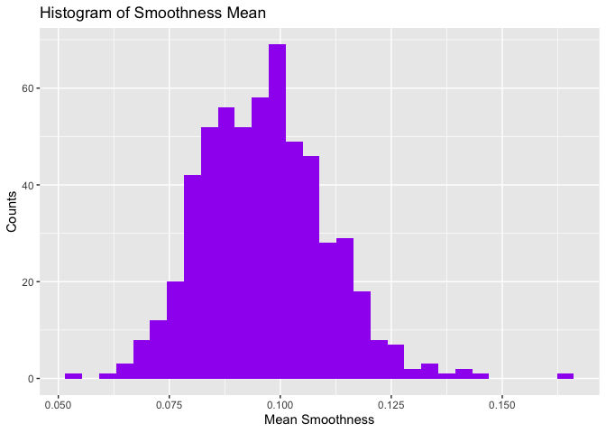
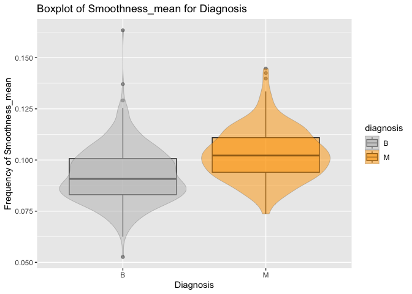
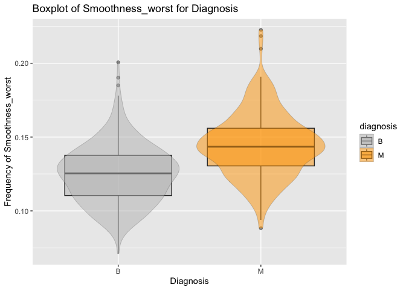
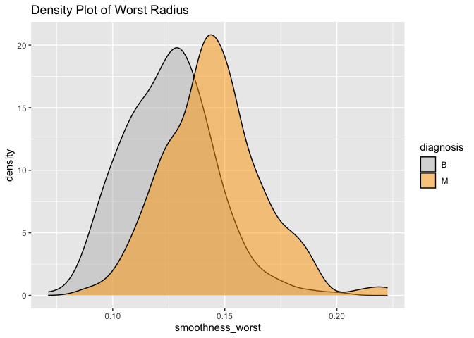

# Welcome to your (maybe) first-ever data analysis project!

And hopefully the first of many. Let’s get started:

1.  Install the [`datateachr`](https://github.com/UBC-MDS/datateachr)
    package by typing the following into your **R terminal**:

\#I tried to run the terminal but errors like “syntax error near
unexpected token” happened, so I switched to use a Markdown to download
the packages and this time it worked well. install.packages(“devtools”)
devtools::install\_github(“UBC-MDS/datateachr”)

1.  Load the packages below.

<!-- -->

    library(datateachr)
    library(tidyverse)

    ## ── Attaching core tidyverse packages ──────────────────────── tidyverse 2.0.0 ──
    ## ✔ dplyr     1.1.3     ✔ readr     2.1.4
    ## ✔ forcats   1.0.0     ✔ stringr   1.5.0
    ## ✔ ggplot2   3.4.2     ✔ tibble    3.2.1
    ## ✔ lubridate 1.9.2     ✔ tidyr     1.3.0
    ## ✔ purrr     1.0.1     
    ## ── Conflicts ────────────────────────────────────────── tidyverse_conflicts() ──
    ## ✖ dplyr::filter() masks stats::filter()
    ## ✖ dplyr::lag()    masks stats::lag()
    ## ℹ Use the conflicted package (<http://conflicted.r-lib.org/>) to force all conflicts to become errors

1.  Make a repository in the <https://github.com/stat545ubc-2023>
    Organization. You can do this by following the steps found on canvas
    in the entry called [MDA: Create a
    repository](https://canvas.ubc.ca/courses/126199/pages/mda-create-a-repository).
    One completed, your repository should automatically be listed as
    part of the stat545ubc-2023 Organization.

# Instructions

## For Both Milestones

-   Each milestone has explicit tasks. Tasks that are more challenging
    will often be allocated more points.

-   Each milestone will be also graded for reproducibility, cleanliness,
    and coherence of the overall Github submission.

-   While the two milestones will be submitted as independent
    deliverables, the analysis itself is a continuum - think of it as
    two chapters to a story. Each chapter, or in this case, portion of
    your analysis, should be easily followed through by someone
    unfamiliar with the content.
    [Here](https://swcarpentry.github.io/r-novice-inflammation/06-best-practices-R/)
    is a good resource for what constitutes “good code”. Learning good
    coding practices early in your career will save you hassle later on!

-   The milestones will be equally weighted.

## For Milestone 1

**To complete this milestone**, edit [this very `.Rmd`
file](https://raw.githubusercontent.com/UBC-STAT/stat545.stat.ubc.ca/master/content/mini-project/mini-project-1.Rmd)
directly. Fill in the sections that are tagged with
`<!--- start your work below --->`.

**To submit this milestone**, make sure to knit this `.Rmd` file to an
`.md` file by changing the YAML output settings from
`output: html_document` to `output: github_document`. Commit and push
all of your work to the mini-analysis GitHub repository you made
earlier, and tag a release on GitHub. Then, submit a link to your tagged
release on canvas.

**Points**: This milestone is worth 36 points: 30 for your analysis, and
6 for overall reproducibility, cleanliness, and coherence of the Github
submission.

# Learning Objectives

By the end of this milestone, you should:

-   Become familiar with your dataset of choosing
-   Select 4 questions that you would like to answer with your data
-   Generate a reproducible and clear report using R Markdown
-   Become familiar with manipulating and summarizing your data in
    tibbles using `dplyr`, with a research question in mind.

# Task 1: Choose your favorite dataset

The `datateachr` package by Hayley Boyce and Jordan Bourak currently
composed of 7 semi-tidy datasets for educational purposes. Here is a
brief description of each dataset:

-   *apt\_buildings*: Acquired courtesy of The City of Toronto’s Open
    Data Portal. It currently has 3455 rows and 37 columns.

-   *building\_permits*: Acquired courtesy of The City of Vancouver’s
    Open Data Portal. It currently has 20680 rows and 14 columns.

-   *cancer\_sample*: Acquired courtesy of UCI Machine Learning
    Repository. It currently has 569 rows and 32 columns.

-   *flow\_sample*: Acquired courtesy of The Government of Canada’s
    Historical Hydrometric Database. It currently has 218 rows and 7
    columns.

-   *parking\_meters*: Acquired courtesy of The City of Vancouver’s Open
    Data Portal. It currently has 10032 rows and 22 columns.

-   *steam\_games*: Acquired courtesy of Kaggle. It currently has 40833
    rows and 21 columns.

-   *vancouver\_trees*: Acquired courtesy of The City of Vancouver’s
    Open Data Portal. It currently has 146611 rows and 20 columns.

**Things to keep in mind**

-   We hope that this project will serve as practice for carrying our
    your own *independent* data analysis. Remember to comment your code,
    be explicit about what you are doing, and write notes in this
    markdown document when you feel that context is required. As you
    advance in the project, prompts and hints to do this will be
    diminished - it’ll be up to you!

-   Before choosing a dataset, you should always keep in mind **your
    goal**, or in other ways, *what you wish to achieve with this data*.
    This mini data-analysis project focuses on *data wrangling*,
    *tidying*, and *visualization*. In short, it’s a way for you to get
    your feet wet with exploring data on your own.

And that is exactly the first thing that you will do!

1.1 **(1 point)** Out of the 7 datasets available in the `datateachr`
package, choose **4** that appeal to you based on their description.
Write your choices below:

**Note**: We encourage you to use the ones in the `datateachr` package,
but if you have a dataset that you’d really like to use, you can include
it here. But, please check with a member of the teaching team to see
whether the dataset is of appropriate complexity. Also, include a
**brief** description of the dataset here to help the teaching team
understand your data.

<!-------------------------- Start your work below ---------------------------->

1: CHOICE\_1\_cancer\_sample 2: CHOICE\_2\_flow\_sample 3:
CHOICE\_3\_vancouver\_trees 4: CHOICE\_4\_apt\_buildings

<!----------------------------------------------------------------------------->

1.2 **(6 points)** One way to narrowing down your selection is to
*explore* the datasets. Use your knowledge of dplyr to find out at least
*3* attributes about each of these datasets (an attribute is something
such as number of rows, variables, class type…). The goal here is to
have an idea of *what the data looks like*.

*Hint:* This is one of those times when you should think about the
cleanliness of your analysis. I added a single code chunk for you below,
but do you want to use more than one? Would you like to write more
comments outside of the code chunk?

<!-------------------------- Start your work below ---------------------------->

\###Explore Here### \### Exploration for cancer\_sample dataset: \*
**Numbers of Rows and Columns (size):** cancer\_sample dataset has 569
rows, 32 column variables. \* **Data types:** Most of the columns are
numeric (dbl). Only “diagnosis” Column is character (chr). \* **Missing
values:** There is no NA value in the cancer\_sample dataset, which
means this dataset is pretty tidy! \* \*\*Order the data with diagnosis,
Benign go first, then Malignant. There are 212 malignant diagnosis

    glimpse(cancer_sample) #To get a glimpse of the data

    ## Rows: 569
    ## Columns: 32
    ## $ ID                      <dbl> 842302, 842517, 84300903, 84348301, 84358402, …
    ## $ diagnosis               <chr> "M", "M", "M", "M", "M", "M", "M", "M", "M", "…
    ## $ radius_mean             <dbl> 17.990, 20.570, 19.690, 11.420, 20.290, 12.450…
    ## $ texture_mean            <dbl> 10.38, 17.77, 21.25, 20.38, 14.34, 15.70, 19.9…
    ## $ perimeter_mean          <dbl> 122.80, 132.90, 130.00, 77.58, 135.10, 82.57, …
    ## $ area_mean               <dbl> 1001.0, 1326.0, 1203.0, 386.1, 1297.0, 477.1, …
    ## $ smoothness_mean         <dbl> 0.11840, 0.08474, 0.10960, 0.14250, 0.10030, 0…
    ## $ compactness_mean        <dbl> 0.27760, 0.07864, 0.15990, 0.28390, 0.13280, 0…
    ## $ concavity_mean          <dbl> 0.30010, 0.08690, 0.19740, 0.24140, 0.19800, 0…
    ## $ concave_points_mean     <dbl> 0.14710, 0.07017, 0.12790, 0.10520, 0.10430, 0…
    ## $ symmetry_mean           <dbl> 0.2419, 0.1812, 0.2069, 0.2597, 0.1809, 0.2087…
    ## $ fractal_dimension_mean  <dbl> 0.07871, 0.05667, 0.05999, 0.09744, 0.05883, 0…
    ## $ radius_se               <dbl> 1.0950, 0.5435, 0.7456, 0.4956, 0.7572, 0.3345…
    ## $ texture_se              <dbl> 0.9053, 0.7339, 0.7869, 1.1560, 0.7813, 0.8902…
    ## $ perimeter_se            <dbl> 8.589, 3.398, 4.585, 3.445, 5.438, 2.217, 3.18…
    ## $ area_se                 <dbl> 153.40, 74.08, 94.03, 27.23, 94.44, 27.19, 53.…
    ## $ smoothness_se           <dbl> 0.006399, 0.005225, 0.006150, 0.009110, 0.0114…
    ## $ compactness_se          <dbl> 0.049040, 0.013080, 0.040060, 0.074580, 0.0246…
    ## $ concavity_se            <dbl> 0.05373, 0.01860, 0.03832, 0.05661, 0.05688, 0…
    ## $ concave_points_se       <dbl> 0.015870, 0.013400, 0.020580, 0.018670, 0.0188…
    ## $ symmetry_se             <dbl> 0.03003, 0.01389, 0.02250, 0.05963, 0.01756, 0…
    ## $ fractal_dimension_se    <dbl> 0.006193, 0.003532, 0.004571, 0.009208, 0.0051…
    ## $ radius_worst            <dbl> 25.38, 24.99, 23.57, 14.91, 22.54, 15.47, 22.8…
    ## $ texture_worst           <dbl> 17.33, 23.41, 25.53, 26.50, 16.67, 23.75, 27.6…
    ## $ perimeter_worst         <dbl> 184.60, 158.80, 152.50, 98.87, 152.20, 103.40,…
    ## $ area_worst              <dbl> 2019.0, 1956.0, 1709.0, 567.7, 1575.0, 741.6, …
    ## $ smoothness_worst        <dbl> 0.1622, 0.1238, 0.1444, 0.2098, 0.1374, 0.1791…
    ## $ compactness_worst       <dbl> 0.6656, 0.1866, 0.4245, 0.8663, 0.2050, 0.5249…
    ## $ concavity_worst         <dbl> 0.71190, 0.24160, 0.45040, 0.68690, 0.40000, 0…
    ## $ concave_points_worst    <dbl> 0.26540, 0.18600, 0.24300, 0.25750, 0.16250, 0…
    ## $ symmetry_worst          <dbl> 0.4601, 0.2750, 0.3613, 0.6638, 0.2364, 0.3985…
    ## $ fractal_dimension_worst <dbl> 0.11890, 0.08902, 0.08758, 0.17300, 0.07678, 0…

    print(any(is.na(cancer_sample))) #To test if any missing value in the dataset

    ## [1] FALSE

    arrange(cancer_sample,diagnosis) #To order rows using column values

    ## # A tibble: 569 × 32
    ##          ID diagnosis radius_mean texture_mean perimeter_mean area_mean
    ##       <dbl> <chr>           <dbl>        <dbl>          <dbl>     <dbl>
    ##  1  8510426 B               13.5          14.4           87.5      566.
    ##  2  8510653 B               13.1          15.7           85.6      520 
    ##  3  8510824 B                9.50         12.4           60.3      274.
    ##  4   854941 B               13.0          18.4           82.6      524.
    ##  5 85713702 B                8.20         16.8           51.7      202.
    ##  6   857155 B               12.0          14.6           78.0      449.
    ##  7   857156 B               13.5          22.3           86.9      561 
    ##  8   857343 B               11.8          21.6           74.7      428.
    ##  9   857373 B               13.6          16.3           87.2      572.
    ## 10   857374 B               11.9          18.2           75.7      438.
    ## # ℹ 559 more rows
    ## # ℹ 26 more variables: smoothness_mean <dbl>, compactness_mean <dbl>,
    ## #   concavity_mean <dbl>, concave_points_mean <dbl>, symmetry_mean <dbl>,
    ## #   fractal_dimension_mean <dbl>, radius_se <dbl>, texture_se <dbl>,
    ## #   perimeter_se <dbl>, area_se <dbl>, smoothness_se <dbl>,
    ## #   compactness_se <dbl>, concavity_se <dbl>, concave_points_se <dbl>,
    ## #   symmetry_se <dbl>, fractal_dimension_se <dbl>, radius_worst <dbl>, …

    filter(cancer_sample,diagnosis=="M") #To filter malignant diagnosis

    ## # A tibble: 212 × 32
    ##          ID diagnosis radius_mean texture_mean perimeter_mean area_mean
    ##       <dbl> <chr>           <dbl>        <dbl>          <dbl>     <dbl>
    ##  1   842302 M                18.0         10.4          123.      1001 
    ##  2   842517 M                20.6         17.8          133.      1326 
    ##  3 84300903 M                19.7         21.2          130       1203 
    ##  4 84348301 M                11.4         20.4           77.6      386.
    ##  5 84358402 M                20.3         14.3          135.      1297 
    ##  6   843786 M                12.4         15.7           82.6      477.
    ##  7   844359 M                18.2         20.0          120.      1040 
    ##  8 84458202 M                13.7         20.8           90.2      578.
    ##  9   844981 M                13           21.8           87.5      520.
    ## 10 84501001 M                12.5         24.0           84.0      476.
    ## # ℹ 202 more rows
    ## # ℹ 26 more variables: smoothness_mean <dbl>, compactness_mean <dbl>,
    ## #   concavity_mean <dbl>, concave_points_mean <dbl>, symmetry_mean <dbl>,
    ## #   fractal_dimension_mean <dbl>, radius_se <dbl>, texture_se <dbl>,
    ## #   perimeter_se <dbl>, area_se <dbl>, smoothness_se <dbl>,
    ## #   compactness_se <dbl>, concavity_se <dbl>, concave_points_se <dbl>,
    ## #   symmetry_se <dbl>, fractal_dimension_se <dbl>, radius_worst <dbl>, …

### Exploration for flow\_sample dataset:

-   **Number of Rows and Columns (size):** flow\_sample dataset has 218
    rows, 7 column variables.
-   **Data types:** Some columns are shown as character (chr) like
    extreme\_type column, but most are numeric data types (dbl).
-   **Missing values:** Some columns like sym contains NA values.

<!-- -->

    glimpse(flow_sample) #To get a glimpse of the data

    ## Rows: 218
    ## Columns: 7
    ## $ station_id   <chr> "05BB001", "05BB001", "05BB001", "05BB001", "05BB001", "0…
    ## $ year         <dbl> 1909, 1910, 1911, 1912, 1913, 1914, 1915, 1916, 1917, 191…
    ## $ extreme_type <chr> "maximum", "maximum", "maximum", "maximum", "maximum", "m…
    ## $ month        <dbl> 7, 6, 6, 8, 6, 6, 6, 6, 6, 6, 6, 7, 6, 6, 6, 7, 5, 7, 6, …
    ## $ day          <dbl> 7, 12, 14, 25, 11, 18, 27, 20, 17, 15, 22, 3, 9, 5, 14, 5…
    ## $ flow         <dbl> 314, 230, 264, 174, 232, 214, 236, 309, 174, 345, 185, 24…
    ## $ sym          <chr> NA, NA, NA, NA, NA, NA, NA, NA, NA, NA, NA, NA, NA, NA, N…

    print(any(is.na(flow_sample))) #To test if any missing value in the dataset

    ## [1] TRUE

### Exploration for vancouver\_trees dataset:

-   **Number of Rows and Columns (size):** vancouver\_trees dataset has
    146,611 rows, 20 column variables.
-   **Data types:** Most columns are character (chr), but also includes
    numeric data types (dbl). One column includes data type as “date”
    (date)
-   **Missing values:** Some columns like cultivar\_name contains NA
    values.
-   \*\*Order the data with diameter, and filter the ones more than 60.
    There are 64 trees with a diameter more than 60

<!-- -->

    glimpse(vancouver_trees) #To get a glimpse of the data

    ## Rows: 146,611
    ## Columns: 20
    ## $ tree_id            <dbl> 149556, 149563, 149579, 149590, 149604, 149616, 149…
    ## $ civic_number       <dbl> 494, 450, 4994, 858, 5032, 585, 4909, 4925, 4969, 7…
    ## $ std_street         <chr> "W 58TH AV", "W 58TH AV", "WINDSOR ST", "E 39TH AV"…
    ## $ genus_name         <chr> "ULMUS", "ZELKOVA", "STYRAX", "FRAXINUS", "ACER", "…
    ## $ species_name       <chr> "AMERICANA", "SERRATA", "JAPONICA", "AMERICANA", "C…
    ## $ cultivar_name      <chr> "BRANDON", NA, NA, "AUTUMN APPLAUSE", NA, "CHANTICL…
    ## $ common_name        <chr> "BRANDON ELM", "JAPANESE ZELKOVA", "JAPANESE SNOWBE…
    ## $ assigned           <chr> "N", "N", "N", "Y", "N", "N", "N", "N", "N", "N", "…
    ## $ root_barrier       <chr> "N", "N", "N", "N", "N", "N", "N", "N", "N", "N", "…
    ## $ plant_area         <chr> "N", "N", "4", "4", "4", "B", "6", "6", "3", "3", "…
    ## $ on_street_block    <dbl> 400, 400, 4900, 800, 5000, 500, 4900, 4900, 4900, 7…
    ## $ on_street          <chr> "W 58TH AV", "W 58TH AV", "WINDSOR ST", "E 39TH AV"…
    ## $ neighbourhood_name <chr> "MARPOLE", "MARPOLE", "KENSINGTON-CEDAR COTTAGE", "…
    ## $ street_side_name   <chr> "EVEN", "EVEN", "EVEN", "EVEN", "EVEN", "ODD", "ODD…
    ## $ height_range_id    <dbl> 2, 4, 3, 4, 2, 2, 3, 3, 2, 2, 2, 5, 3, 2, 2, 2, 2, …
    ## $ diameter           <dbl> 10.00, 10.00, 4.00, 18.00, 9.00, 5.00, 15.00, 14.00…
    ## $ curb               <chr> "N", "N", "Y", "Y", "Y", "Y", "Y", "Y", "Y", "Y", "…
    ## $ date_planted       <date> 1999-01-13, 1996-05-31, 1993-11-22, 1996-04-29, 19…
    ## $ longitude          <dbl> -123.1161, -123.1147, -123.0846, -123.0870, -123.08…
    ## $ latitude           <dbl> 49.21776, 49.21776, 49.23938, 49.23469, 49.23894, 4…

    print(any(is.na(vancouver_trees))) #To test if any missing value in the dataset

    ## [1] TRUE

    arrange(vancouver_trees,diameter) #To order the data with diameter

    ## # A tibble: 146,611 × 20
    ##    tree_id civic_number std_street    genus_name  species_name  cultivar_name   
    ##      <dbl>        <dbl> <chr>         <chr>       <chr>         <chr>           
    ##  1  158784         6340 COMMERCIAL ST LIQUIDAMBAR STYRACIFLUA   WORPLESDON      
    ##  2   32577         3870 W 33RD AV     ACER        CAMPESTRE     QUEEN ELIZABETH 
    ##  3   12605         4553 W 12TH AV     PRUNUS      CERASIFERA    NIGRA           
    ##  4  197126         6086 DUNBAR ST     PRUNUS      X YEDOENSIS   AKEBONO         
    ##  5  231280         3640 E 28TH AV     MAGNOLIA    XX            GALAXY          
    ##  6  231952         2006 E 3RD AV      AMELANCHIER GRANDIFLORA X AUTUMN BRILLIAN…
    ##  7  231953         2069 E 3RD AV      PARROTIA    PERSICA       VANESSA         
    ##  8  208057          221 E 63RD AV     PRUNUS      CERASIFERA    NIGRA           
    ##  9  184766         6226 MONTGOMERY ST STYRAX      JAPONICA      SNOWCONE        
    ## 10  188671         1955 CORNWALL AV   ACER        PLATANOIDES   <NA>            
    ## # ℹ 146,601 more rows
    ## # ℹ 14 more variables: common_name <chr>, assigned <chr>, root_barrier <chr>,
    ## #   plant_area <chr>, on_street_block <dbl>, on_street <chr>,
    ## #   neighbourhood_name <chr>, street_side_name <chr>, height_range_id <dbl>,
    ## #   diameter <dbl>, curb <chr>, date_planted <date>, longitude <dbl>,
    ## #   latitude <dbl>

    filter(vancouver_trees,diameter>60) #To filter trees with diameters more than 60

    ## # A tibble: 64 × 20
    ##    tree_id civic_number std_street       genus_name   species_name cultivar_name
    ##      <dbl>        <dbl> <chr>            <chr>        <chr>        <chr>        
    ##  1  161226         3927 W 37TH AV        PSEUDOTSUGA  MENZIESII    <NA>         
    ##  2  222821         3490 W 7TH AV         POPULUS      NIGRA        ITALICA      
    ##  3  182674         1488 E 64TH AV        ULMUS        AMERICANA    BRANDON      
    ##  4  184211         4210 W 16TH AV        QUERCUS      PHELLOS      <NA>         
    ##  5   23759          554 W 22ND AV        PRUNUS       SERRULATA    KWANZAN      
    ##  6  142060         4050 CARTIER ST       CORNUS       NUTTALLII    <NA>         
    ##  7  142098         4050 OSLER ST         CHAMAECYPAR… LAWSONIANA   <NA>         
    ##  8  142099         1063 W KING EDWARD AV CORNUS       NUTTALLII    <NA>         
    ##  9   51001          849 W 60TH AV        ACER         SACCHARINUM  <NA>         
    ## 10  126266         4239 CAMBIE ST        SEQUOIADEND… GIGANTEUM    <NA>         
    ## # ℹ 54 more rows
    ## # ℹ 14 more variables: common_name <chr>, assigned <chr>, root_barrier <chr>,
    ## #   plant_area <chr>, on_street_block <dbl>, on_street <chr>,
    ## #   neighbourhood_name <chr>, street_side_name <chr>, height_range_id <dbl>,
    ## #   diameter <dbl>, curb <chr>, date_planted <date>, longitude <dbl>,
    ## #   latitude <dbl>

### Exploration for apt\_buildings dataset:

-   **Number of Rows and Columns (size):** apt\_buildings dataset has
    3,455 rows, 37 column variables.
-   **Data types:** Include both character (chr),and numeric data types
    (dbl).
-   **Missing values:** Some columns contains NA values, if we need to
    explore further, we need to tidy the dataset.
-   \*\*Order the data with emergency\_power, and filter the ones do not
    have. There are 1,928 apts without emergency power

<!-- -->

    glimpse(apt_buildings) #To get a glimpse of the data

    ## Rows: 3,455
    ## Columns: 37
    ## $ id                               <dbl> 10359, 10360, 10361, 10362, 10363, 10…
    ## $ air_conditioning                 <chr> "NONE", "NONE", "NONE", "NONE", "NONE…
    ## $ amenities                        <chr> "Outdoor rec facilities", "Outdoor po…
    ## $ balconies                        <chr> "YES", "YES", "YES", "YES", "NO", "NO…
    ## $ barrier_free_accessibilty_entr   <chr> "YES", "NO", "NO", "YES", "NO", "NO",…
    ## $ bike_parking                     <chr> "0 indoor parking spots and 10 outdoo…
    ## $ exterior_fire_escape             <chr> "NO", "NO", "NO", "YES", "NO", NA, "N…
    ## $ fire_alarm                       <chr> "YES", "YES", "YES", "YES", "YES", "Y…
    ## $ garbage_chutes                   <chr> "YES", "YES", "NO", "NO", "NO", "NO",…
    ## $ heating_type                     <chr> "HOT WATER", "HOT WATER", "HOT WATER"…
    ## $ intercom                         <chr> "YES", "YES", "YES", "YES", "YES", "Y…
    ## $ laundry_room                     <chr> "YES", "YES", "YES", "YES", "YES", "Y…
    ## $ locker_or_storage_room           <chr> "NO", "YES", "YES", "YES", "NO", "YES…
    ## $ no_of_elevators                  <dbl> 3, 3, 0, 1, 0, 0, 0, 2, 4, 2, 0, 2, 2…
    ## $ parking_type                     <chr> "Underground Garage , Garage accessib…
    ## $ pets_allowed                     <chr> "YES", "YES", "YES", "YES", "YES", "Y…
    ## $ prop_management_company_name     <chr> NA, "SCHICKEDANZ BROS. PROPERTIES", N…
    ## $ property_type                    <chr> "PRIVATE", "PRIVATE", "PRIVATE", "PRI…
    ## $ rsn                              <dbl> 4154812, 4154815, 4155295, 4155309, 4…
    ## $ separate_gas_meters              <chr> "NO", "NO", "NO", "NO", "NO", "NO", "…
    ## $ separate_hydro_meters            <chr> "YES", "YES", "YES", "YES", "YES", "Y…
    ## $ separate_water_meters            <chr> "NO", "NO", "NO", "NO", "NO", "NO", "…
    ## $ site_address                     <chr> "65  FOREST MANOR RD", "70  CLIPPER R…
    ## $ sprinkler_system                 <chr> "YES", "YES", "NO", "YES", "NO", "NO"…
    ## $ visitor_parking                  <chr> "PAID", "FREE", "UNAVAILABLE", "UNAVA…
    ## $ ward                             <chr> "17", "17", "03", "03", "02", "02", "…
    ## $ window_type                      <chr> "DOUBLE PANE", "DOUBLE PANE", "DOUBLE…
    ## $ year_built                       <dbl> 1967, 1970, 1927, 1959, 1943, 1952, 1…
    ## $ year_registered                  <dbl> 2017, 2017, 2017, 2017, 2017, NA, 201…
    ## $ no_of_storeys                    <dbl> 17, 14, 4, 5, 4, 4, 4, 7, 32, 4, 4, 7…
    ## $ emergency_power                  <chr> "NO", "YES", "NO", "NO", "NO", "NO", …
    ## $ `non-smoking_building`           <chr> "YES", "NO", "YES", "YES", "YES", "NO…
    ## $ no_of_units                      <dbl> 218, 206, 34, 42, 25, 34, 14, 105, 57…
    ## $ no_of_accessible_parking_spaces  <dbl> 8, 10, 20, 42, 12, 0, 5, 1, 1, 6, 12,…
    ## $ facilities_available             <chr> "Recycling bins", "Green Bin / Organi…
    ## $ cooling_room                     <chr> "NO", "NO", "NO", "NO", "NO", "NO", "…
    ## $ no_barrier_free_accessible_units <dbl> 2, 0, 0, 42, 0, NA, 14, 0, 0, 1, 25, …

    print(any(is.na(apt_buildings))) #To test if any missing value in the dataset

    ## [1] TRUE

    arrange(apt_buildings,emergency_power) #To order the data with emergency_power

    ## # A tibble: 3,455 × 37
    ##       id air_conditioning amenities             balconies barrier_free_accessi…¹
    ##    <dbl> <chr>            <chr>                 <chr>     <chr>                 
    ##  1 10359 NONE             Outdoor rec faciliti… YES       YES                   
    ##  2 10361 NONE             <NA>                  YES       NO                    
    ##  3 10362 NONE             <NA>                  YES       YES                   
    ##  4 10363 NONE             <NA>                  NO        NO                    
    ##  5 10364 NONE             <NA>                  NO        NO                    
    ##  6 10365 NONE             <NA>                  NO        YES                   
    ##  7 10367 NONE             <NA>                  YES       YES                   
    ##  8 10370 NONE             <NA>                  YES       NO                    
    ##  9 10371 NONE             <NA>                  YES       YES                   
    ## 10 10372 NONE             <NA>                  YES       NO                    
    ## # ℹ 3,445 more rows
    ## # ℹ abbreviated name: ¹​barrier_free_accessibilty_entr
    ## # ℹ 32 more variables: bike_parking <chr>, exterior_fire_escape <chr>,
    ## #   fire_alarm <chr>, garbage_chutes <chr>, heating_type <chr>, intercom <chr>,
    ## #   laundry_room <chr>, locker_or_storage_room <chr>, no_of_elevators <dbl>,
    ## #   parking_type <chr>, pets_allowed <chr>, prop_management_company_name <chr>,
    ## #   property_type <chr>, rsn <dbl>, separate_gas_meters <chr>, …

    filter(apt_buildings,emergency_power=="NO")

    ## # A tibble: 1,928 × 37
    ##       id air_conditioning amenities             balconies barrier_free_accessi…¹
    ##    <dbl> <chr>            <chr>                 <chr>     <chr>                 
    ##  1 10359 NONE             Outdoor rec faciliti… YES       YES                   
    ##  2 10361 NONE             <NA>                  YES       NO                    
    ##  3 10362 NONE             <NA>                  YES       YES                   
    ##  4 10363 NONE             <NA>                  NO        NO                    
    ##  5 10364 NONE             <NA>                  NO        NO                    
    ##  6 10365 NONE             <NA>                  NO        YES                   
    ##  7 10367 NONE             <NA>                  YES       YES                   
    ##  8 10370 NONE             <NA>                  YES       NO                    
    ##  9 10371 NONE             <NA>                  YES       YES                   
    ## 10 10372 NONE             <NA>                  YES       NO                    
    ## # ℹ 1,918 more rows
    ## # ℹ abbreviated name: ¹​barrier_free_accessibilty_entr
    ## # ℹ 32 more variables: bike_parking <chr>, exterior_fire_escape <chr>,
    ## #   fire_alarm <chr>, garbage_chutes <chr>, heating_type <chr>, intercom <chr>,
    ## #   laundry_room <chr>, locker_or_storage_room <chr>, no_of_elevators <dbl>,
    ## #   parking_type <chr>, pets_allowed <chr>, prop_management_company_name <chr>,
    ## #   property_type <chr>, rsn <dbl>, separate_gas_meters <chr>, …

<!----------------------------------------------------------------------------->

1.3 **(1 point)** Now that you’ve explored the 4 datasets that you were
initially most interested in, let’s narrow it down to 1. What lead you
to choose this one? Briefly explain your choice below.

<!-------------------------- Start your work below ---------------------------->

**Answer for Question 1.3:** I would be more interested in the
cancer\_dataset. This dataset provides a combination of methods
describing the features of cancers, I’m curious to find out how those
features may affect the diagnosis of cancer cells.  
<!----------------------------------------------------------------------------->

1.4 **(2 points)** Time for a final decision! Going back to the
beginning, it’s important to have an *end goal* in mind. For example, if
I had chosen the `titanic` dataset for my project, I might’ve wanted to
explore the relationship between survival and other variables. Try to
think of 1 research question that you would want to answer with your
dataset. Note it down below.

<!-------------------------- Start your work below ---------------------------->

**Answer for Question 1.4:** I had chosen the ‘cancer\_dataset’ for my
project. I might’ve wanted to explore the relationship between
“smoothness” of the tumer and the malignant diagnosis.
<!----------------------------------------------------------------------------->

# Important note

Read Tasks 2 and 3 *fully* before starting to complete either of them.
Probably also a good point to grab a coffee to get ready for the fun
part!

This project is semi-guided, but meant to be *independent*. For this
reason, you will complete tasks 2 and 3 below (under the **START HERE**
mark) as if you were writing your own exploratory data analysis report,
and this guidance never existed! Feel free to add a brief introduction
section to your project, format the document with markdown syntax as you
deem appropriate, and structure the analysis as you deem appropriate. If
you feel lost, you can find a sample data analysis
[here](https://www.kaggle.com/headsortails/tidy-titarnic) to have a
better idea. However, bear in mind that it is **just an example** and
you will not be required to have that level of complexity in your
project.

# Task 2: Exploring your dataset

If we rewind and go back to the learning objectives, you’ll see that by
the end of this deliverable, you should have formulated *4* research
questions about your data that you may want to answer during your
project. However, it may be handy to do some more exploration on your
dataset of choice before creating these questions - by looking at the
data, you may get more ideas. **Before you start this task, read all
instructions carefully until you reach START HERE under Task 3**.

2.1 **(12 points)** Complete *4 out of the following 8 exercises* to
dive deeper into your data. All datasets are different and therefore,
not all of these tasks may make sense for your data - which is why you
should only answer *4*.

Make sure that you’re using dplyr and ggplot2 rather than base R for
this task. Outside of this project, you may find that you prefer using
base R functions for certain tasks, and that’s just fine! But part of
this project is for you to practice the tools we learned in class, which
is dplyr and ggplot2.

1.  Plot the distribution of a numeric variable.
2.  Create a new variable based on other variables in your data (only if
    it makes sense)
3.  Investigate how many missing values there are per variable. Can you
    find a way to plot this?
4.  Explore the relationship between 2 variables in a plot.
5.  Filter observations in your data according to your own criteria.
    Think of what you’d like to explore - again, if this was the
    `titanic` dataset, I may want to narrow my search down to passengers
    born in a particular year…
6.  Use a boxplot to look at the frequency of different observations
    within a single variable. You can do this for more than one variable
    if you wish!
7.  Make a new tibble with a subset of your data, with variables and
    observations that you are interested in exploring.
8.  Use a density plot to explore any of your variables (that are
    suitable for this type of plot).

2.2 **(4 points)** For each of the 4 exercises that you complete,
provide a *brief explanation* of why you chose that exercise in relation
to your data (in other words, why does it make sense to do that?), and
sufficient comments for a reader to understand your reasoning and code.

<!-------------------------- Start your work below ---------------------------->

**Exercises 1**: Plot the distribution of smoothness\_mean **Brief
Explanation for Exercise 1** The reason I explore the distribution of
smoothness\_mean using a histogram to view which smoothness level have a
higher concentration of cancers. This information is evaluated for a
general status of tumor samples.

    library(ggplot2)
    library(dplyr)
    glimpse(cancer_sample)

    ## Rows: 569
    ## Columns: 32
    ## $ ID                      <dbl> 842302, 842517, 84300903, 84348301, 84358402, …
    ## $ diagnosis               <chr> "M", "M", "M", "M", "M", "M", "M", "M", "M", "…
    ## $ radius_mean             <dbl> 17.990, 20.570, 19.690, 11.420, 20.290, 12.450…
    ## $ texture_mean            <dbl> 10.38, 17.77, 21.25, 20.38, 14.34, 15.70, 19.9…
    ## $ perimeter_mean          <dbl> 122.80, 132.90, 130.00, 77.58, 135.10, 82.57, …
    ## $ area_mean               <dbl> 1001.0, 1326.0, 1203.0, 386.1, 1297.0, 477.1, …
    ## $ smoothness_mean         <dbl> 0.11840, 0.08474, 0.10960, 0.14250, 0.10030, 0…
    ## $ compactness_mean        <dbl> 0.27760, 0.07864, 0.15990, 0.28390, 0.13280, 0…
    ## $ concavity_mean          <dbl> 0.30010, 0.08690, 0.19740, 0.24140, 0.19800, 0…
    ## $ concave_points_mean     <dbl> 0.14710, 0.07017, 0.12790, 0.10520, 0.10430, 0…
    ## $ symmetry_mean           <dbl> 0.2419, 0.1812, 0.2069, 0.2597, 0.1809, 0.2087…
    ## $ fractal_dimension_mean  <dbl> 0.07871, 0.05667, 0.05999, 0.09744, 0.05883, 0…
    ## $ radius_se               <dbl> 1.0950, 0.5435, 0.7456, 0.4956, 0.7572, 0.3345…
    ## $ texture_se              <dbl> 0.9053, 0.7339, 0.7869, 1.1560, 0.7813, 0.8902…
    ## $ perimeter_se            <dbl> 8.589, 3.398, 4.585, 3.445, 5.438, 2.217, 3.18…
    ## $ area_se                 <dbl> 153.40, 74.08, 94.03, 27.23, 94.44, 27.19, 53.…
    ## $ smoothness_se           <dbl> 0.006399, 0.005225, 0.006150, 0.009110, 0.0114…
    ## $ compactness_se          <dbl> 0.049040, 0.013080, 0.040060, 0.074580, 0.0246…
    ## $ concavity_se            <dbl> 0.05373, 0.01860, 0.03832, 0.05661, 0.05688, 0…
    ## $ concave_points_se       <dbl> 0.015870, 0.013400, 0.020580, 0.018670, 0.0188…
    ## $ symmetry_se             <dbl> 0.03003, 0.01389, 0.02250, 0.05963, 0.01756, 0…
    ## $ fractal_dimension_se    <dbl> 0.006193, 0.003532, 0.004571, 0.009208, 0.0051…
    ## $ radius_worst            <dbl> 25.38, 24.99, 23.57, 14.91, 22.54, 15.47, 22.8…
    ## $ texture_worst           <dbl> 17.33, 23.41, 25.53, 26.50, 16.67, 23.75, 27.6…
    ## $ perimeter_worst         <dbl> 184.60, 158.80, 152.50, 98.87, 152.20, 103.40,…
    ## $ area_worst              <dbl> 2019.0, 1956.0, 1709.0, 567.7, 1575.0, 741.6, …
    ## $ smoothness_worst        <dbl> 0.1622, 0.1238, 0.1444, 0.2098, 0.1374, 0.1791…
    ## $ compactness_worst       <dbl> 0.6656, 0.1866, 0.4245, 0.8663, 0.2050, 0.5249…
    ## $ concavity_worst         <dbl> 0.71190, 0.24160, 0.45040, 0.68690, 0.40000, 0…
    ## $ concave_points_worst    <dbl> 0.26540, 0.18600, 0.24300, 0.25750, 0.16250, 0…
    ## $ symmetry_worst          <dbl> 0.4601, 0.2750, 0.3613, 0.6638, 0.2364, 0.3985…
    ## $ fractal_dimension_worst <dbl> 0.11890, 0.08902, 0.08758, 0.17300, 0.07678, 0…

    SM_mean_hg <- ggplot(cancer_sample, aes(smoothness_mean)) +
      geom_histogram(bins = 30,fill = "purple") +
      labs(title = "Histogram of Smoothness Mean",
           x = "Mean Smoothness",
           y = "Counts") 
    print(SM_mean_hg)

\##Observation of Exercise 1: Most of the samples in the dataset have a
smoothness level around 0.100. Based on the knowledge we know, the
smoother the tumor is, the less risk of being malignant. However, we
cannot tell what the relationship between the values provided in the
dataset to the real appearance of the samples.

### Exercise 6: Use boxplots to show the difference observed between Benign and Malignant groups based on Smooth level

I would like to see whether there will be any difference between benign
and malignant groups in “smooth” characters.And I also would like to
know how the samples are distributed.

    SM_mean_boxplot <- ggplot(cancer_sample, aes(x=diagnosis, y=smoothness_mean, fill = diagnosis)) +
      geom_boxplot(alpha = 0.5) +
      scale_fill_manual(values = c("M" = "orange", "B" = "grey"))+ 
      geom_violin(alpha = 0.5,linewidth=0.08)+
      labs(title = "Boxplot of Smoothness_mean for Diagnosis",
           x= "Diagnosis",
           y= "Frequency of Smoothness_mean") 
    print(SM_mean_boxplot)

\### Exercise 6: Use boxplots to show the difference observed between
Benign and Malignant groups based on Smooth level

    SM_worst_boxplot <- ggplot(cancer_sample, aes(x=diagnosis, y=smoothness_worst, fill = diagnosis)) +
      geom_boxplot(alpha = 0.5) +
      scale_fill_manual(values = c("M" = "orange", "B" = "grey"))+ 
      geom_violin(alpha = 0.5,linewidth=0.08)+
      labs(title = "Boxplot of Smoothness_worst for Diagnosis",
           x= "Diagnosis",
           y= "Frequency of Smoothness_worst") 
    print(SM_worst_boxplot)

\## Observation of Exercise 6: In malignant group, samples are have a
higher smooth value than the benign group. However, from the dataset, we
cannot not tell what the valves of smoothness mean, which means from the
values we cannot tell which one is smoother than the others. So the
results can only show the difference based on the values.

\###Exercise 7: Make a new tibble with a subset of the data for
smoothness

    # create a new tibble with the the following selected variables
    SM_Subset <- cancer_sample %>%
      select(ID,diagnosis,smoothness_mean,smoothness_se,smoothness_worst)
    SM_Subset

    ## # A tibble: 569 × 5
    ##          ID diagnosis smoothness_mean smoothness_se smoothness_worst
    ##       <dbl> <chr>               <dbl>         <dbl>            <dbl>
    ##  1   842302 M                  0.118        0.00640            0.162
    ##  2   842517 M                  0.0847       0.00522            0.124
    ##  3 84300903 M                  0.110        0.00615            0.144
    ##  4 84348301 M                  0.142        0.00911            0.210
    ##  5 84358402 M                  0.100        0.0115             0.137
    ##  6   843786 M                  0.128        0.00751            0.179
    ##  7   844359 M                  0.0946       0.00431            0.144
    ##  8 84458202 M                  0.119        0.00880            0.165
    ##  9   844981 M                  0.127        0.00573            0.170
    ## 10 84501001 M                  0.119        0.00715            0.185
    ## # ℹ 559 more rows

    # group the tibble by diagnosis
    SM_Sum <- SM_Subset %>%
      group_by(diagnosis) %>%
      # add some new variables
      summarize(
        num_sample = n(),
        M_num = sum(diagnosis == "M"),
        B_num = sum(diagnosis == "B")
      )

    SM_Sum

    ## # A tibble: 2 × 4
    ##   diagnosis num_sample M_num B_num
    ##   <chr>          <int> <int> <int>
    ## 1 B                357     0   357
    ## 2 M                212   212     0

\##Observation of Exercise 7: In the cancer\_dataset, there are more
benign samples than malignant samples. The samples are not balanced.If
we need to explore further, we need to pair the samples or use other
methods to make the number balance.

### Exercise 8: Use density plot to explore the smoothness\_worst as extreme cases

I would like to explore the smooth status in the extreme cases

    SM_worst_Dplot <- ggplot(cancer_sample, aes(x = smoothness_worst, fill = diagnosis)) +
      geom_density(alpha = 0.5) + 
      labs( title = "Density Plot of Worst Radius") +
      scale_fill_manual(values = c("M" = "orange", "B" = "grey"))
    print(SM_worst_Dplot)

## observation of Exercise 8:

A higher density is observed in malignant (M) group. We can suspect that
the smooth level is a factor that affecting cancer diagnosis, however,
more tests are needed to be done for a comfirmation.

<!----------------------------------------------------------------------------->

# Task 3: Choose research questions

**(4 points)** So far, you have chosen a dataset and gotten familiar
with it through exploring the data. You have also brainstormed one
research question that interested you (Task 1.4). Now it’s time to pick
4 research questions that you would like to explore in Milestone 2!
Write the 4 questions and any additional comments below.

<!--- *****START HERE***** --->

**Task 3 Answers:**

1.  Are the smoothness related to the compactness features? If so, how
    strong they are related and how to use them to predict cancer
    diagnosis?

2.  Can the values in each column reflect the tumor status? If in the
    real research field, how should we evaluate these values?

3.  In spite of smoothness, what else can we select to predict tumors?
    and how to compare the new one with smoothness?

4.  How are the values different in benign group? Can we find any clue
    from the values that can predict it before it turns to malignant?

<!----------------------------->

# Overall reproducibility/Cleanliness/Coherence Checklist

## Coherence (0.5 points)

The document should read sensibly from top to bottom, with no major
continuity errors. An example of a major continuity error is having a
data set listed for Task 3 that is not part of one of the data sets
listed in Task 1.

## Error-free code (3 points)

For full marks, all code in the document should run without error. 1
point deduction if most code runs without error, and 2 points deduction
if more than 50% of the code throws an error.

## Main README (1 point)

There should be a file named `README.md` at the top level of your
repository. Its contents should automatically appear when you visit the
repository on GitHub.

Minimum contents of the README file:

-   In a sentence or two, explains what this repository is, so that
    future-you or someone else stumbling on your repository can be
    oriented to the repository.
-   In a sentence or two (or more??), briefly explains how to engage
    with the repository. You can assume the person reading knows the
    material from STAT 545A. Basically, if a visitor to your repository
    wants to explore your project, what should they know?

Once you get in the habit of making README files, and seeing more README
files in other projects, you’ll wonder how you ever got by without them!
They are tremendously helpful.

## Output (1 point)

All output is readable, recent and relevant:

-   All Rmd files have been `knit`ted to their output md files.
-   All knitted md files are viewable without errors on Github. Examples
    of errors: Missing plots, “Sorry about that, but we can’t show files
    that are this big right now” messages, error messages from broken R
    code
-   All of these output files are up-to-date – that is, they haven’t
    fallen behind after the source (Rmd) files have been updated.
-   There should be no relic output files. For example, if you were
    knitting an Rmd to html, but then changed the output to be only a
    markdown file, then the html file is a relic and should be deleted.

(0.5 point deduction if any of the above criteria are not met. 1 point
deduction if most or all of the above criteria are not met.)

Our recommendation: right before submission, delete all output files,
and re-knit each milestone’s Rmd file, so that everything is up to date
and relevant. Then, after your final commit and push to Github, CHECK on
Github to make sure that everything looks the way you intended!

## Tagged release (0.5 points)

You’ve tagged a release for Milestone 1.

### Attribution

Thanks to Icíar Fernández Boyano for mostly putting this together, and
Vincenzo Coia for launching.
